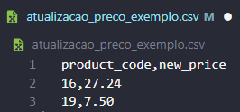
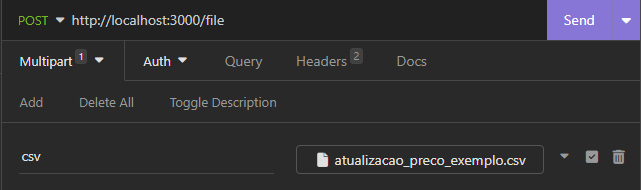
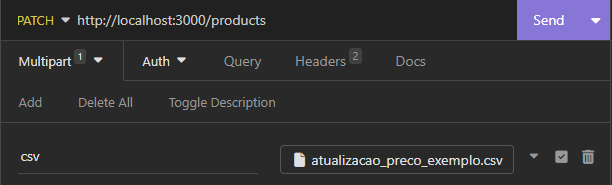

# Api E-Commerce Updater Pro

## Sobre o projeto:

Esse projeto foi desenvolvida para auxiliar empresas de e-commerce na atualização de seus produtos. Seu principal objetivo é permitir a atualização dos preços dos produtos de forma massiva, através do envio de arquivo CSV, tornando esse processo mais rápido e eficiente.

A API conta com alguns recursos de verificação que permitem evitar erros durante a alteração de tais valores.

## Como utilizar os códigos desse repositório:

Para utilizar essa API localmente siga os passos descritos abaixo:

1. Faça um fork desse repositório para a sua coleção de repositórios no GitHub (Caso não queira clonar diretamente);
2. Clone o repositório para sua máquina;
3. Abra o projeto no seu editor de códigos (IDE) e no terminal digite o comando "npm install" para instalar as dependências (É preciso está na pasta do projeto);
4. No diretório ```src``` do projeto, vá na pasta ```database```, copie os códigos presentes no arquivo ```database.sql``` e cole na ferramenta que você utiliza para criar e manipular banco de dados (Ex.: Oracle SQL Developer,MySQL Workbench, Beekeeper Studio...). O banco de dados que deve ser utilizado é o ```MySQL``` (Instale-o caso não tenha);
5. Mude o nome do arquivo ```.env.example``` para ```.env```, é nele que estão todas as variáveis de ambiente para conexão com o banco de dados e porta de acesso ao servidor "process.env". Preencha as variáveis conforme as configurações que utiliza no seu computador para acessar bancos de dados locais. Veja o exemplo a seguir: 

.env
```javascript
PORT=3000
DB_HOST=localhost
DB_PORT=3306
DB_USER=admin
DB_PASS=admin
DB_NAME=e_commerce_db
```
OBS.: Geralmente a configuração padrão passada para as variáveis de ambiente e essa exemplificada acima, com exceção do nome de usuário do banco de dados e a senha (DB_USER e DB_PASS) que são escolhidas ao instalar o banco de dados no computador.

6. Após configurar as variáveis de ambiente basta rodar o comando "npm run dev" no terminal do editor de códigos (É preciso está na pasta do projeto)

OBS.: A conexão com o banco de dados está sendo feita pela biblioteca ```knex```. Isso pode ser visto em ```database > connection.tj```

```javascript
import connection from 'knex';

export const knex = connection({
  client: 'mysql2',
  connection: {
    host: process.env.DB_HOST,
    port: Number(process.env.DB_PORT),
    user: process.env.DB_USER,
    password: process.env.DB_PASS,
    database: process.env.DB_NAME
  }
});
```

## Endpoints

 ### 1. POST /file

Essa rota irá receber o arquivo CSV com as informações necessárias para atualizar os preços dos produtos existentes no banco de dados. (Esse repositório possui um exemplo de arquivo CSV para teste).

Ao receber o arquivo, o sistema fará as verificações necessárias e retornará uma resposta para o usuário informando os erros presentes no arquivo, caso exista algum.

#### Exemplo de arquivo CSV que deverá ser enviado



#### Exemplo de requisição
A requisição deve ser do tipo multipart/form-data. O name esperado pela API é "csv". O arquivo enviado deve ser do tipo  "text/csv" (extensão .csv);



#### Exemplo de respostas
```json 
[
    {
        "product_code": "16",
        "new_price": "27.24",
        "name": "AZEITE  PORTUGUÊS  EXTRA VIRGEM GALLO 500ML",
        "sales_price": "27.24",
        "broken_rules": []
    },
    {
        "product_code": "19",
        "new_price": "7.50",
        "name": "ENERGÉTICA  RED BULL ENERGY DRINK 250ML",
        "sales_price": "7.50",
        "broken_rules": [
            "Esse produto faz parte de um pacote. As informações do código do pacote e seu novo preço também devem estar no arquivo CSV. Código do Pacote: 1020"
        ]
    }
]
```
```json
[
    {
        "product_code": "16",
        "new_price": "27.24",
        "name": "AZEITE  PORTUGUÊS  EXTRA VIRGEM GALLO 500ML",
        "sales_price": "27.24",
        "broken_rules": []
    },
    {
        "product_code": "19",
        "new_price": "7.50",
        "name": "ENERGÉTICA  RED BULL ENERGY DRINK 250ML",
        "sales_price": "7.50",
        "broken_rules": []
    }
]
```
```json
{
    "mensagem": "Nenhum arquivo CSV enviado"
}
```
```json
{
    "mensagem": "O arquivo enviado não é CSV"
}
```

### 2. PATCH /products

Essa rota também receberá o arquivo CSV com as informações necessárias para atualizar os preços dos produtos existentes no banco de dados. (Esse repositório possui um exemplo de arquivo CSV para teste).

Porém ao receber o arquivo, a API fará as verificações necessárias e caso esteja tudo certo ela enviará e atualizará as informações do banco de dados. 

#### Exemplo de requisição

A requisição deve ser do tipo multipart/form-data. O name esperado pela API é "csv". O arquivo enviado deve ser do tipo "text/csv" (extensão .csv);



#### Exemplo de respostas
```json
{
    "mensagem": "Existem pendências a serem resolvidas no arquivo CSV. Por favor, resolva essas pendências e reenvie o arquivo para nova verificação"
}
```
```json
{
    "mensagem": "Preços atualizados com sucesso!"
}
```
```json
{
    "mensagem": "Nenhum arquivo CSV enviado"
}
```
```json
{
    "mensagem": "O arquivo enviado não é CSV"
}
```